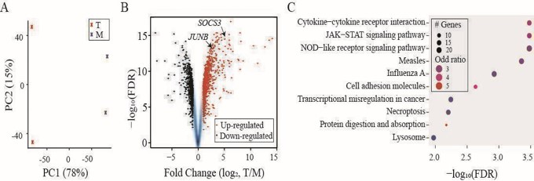
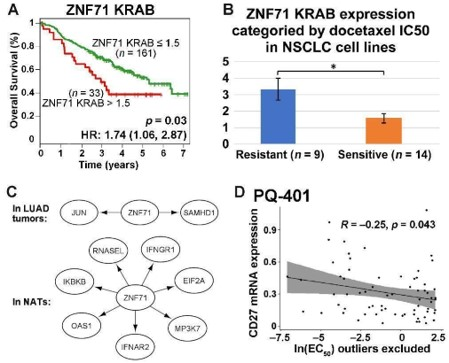
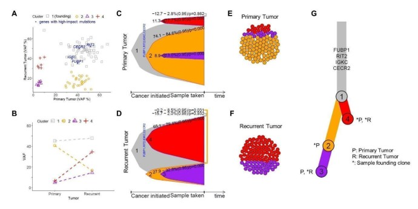
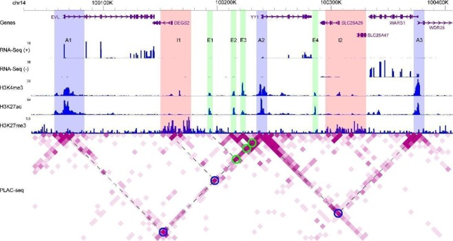
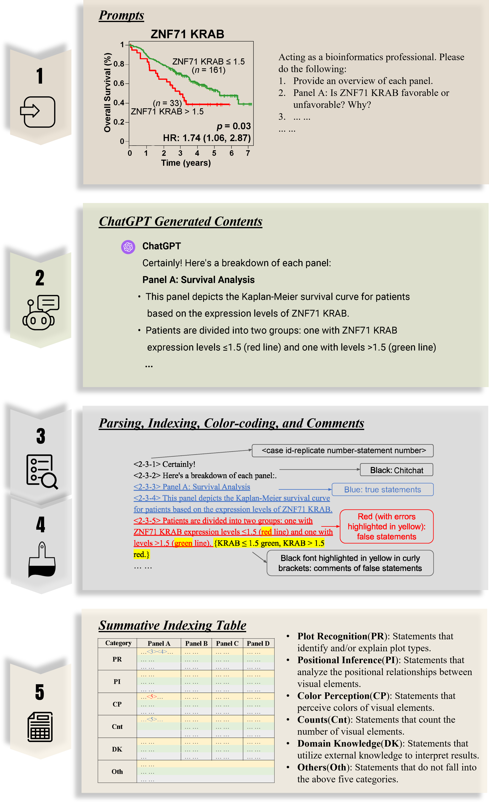
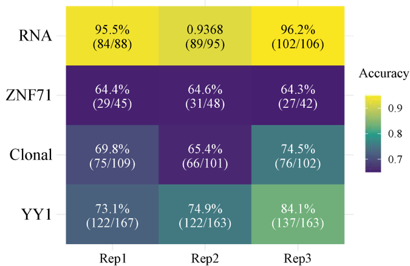
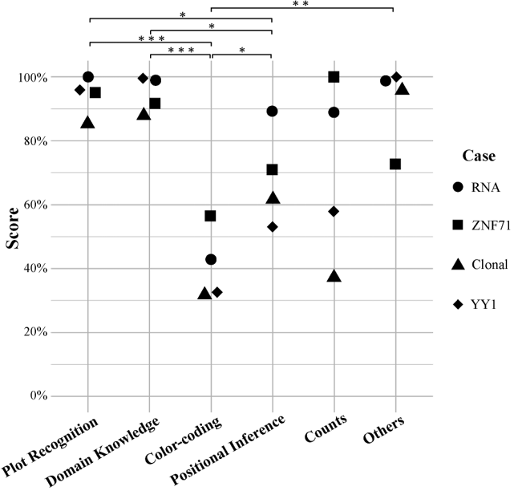
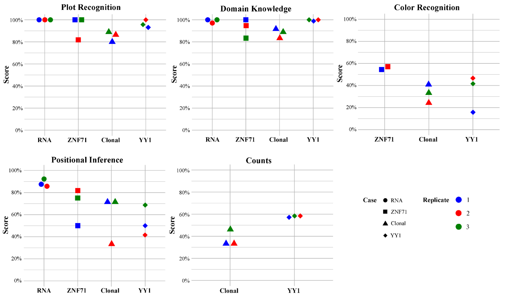
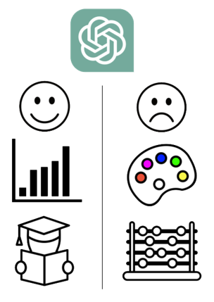

# **Scientific Figures Interpreted by ChatGPT**

## Introduction

* This work evaluates ChatGPT's GPT-4V(ision) capabilities in deciphering bioinformatics figures.
* Assessed areas include sequencing data analysis, drug repositioning, and tumor evolution.
* Finds ChatGPT proficient in explaining plot types and applying biological insights.
* Identifies challenges in color perception and quantitative visual analysis.
* Emphasizes the need for stringent proofreading for accuracy and reliability.

📃 [Read the Full Paper](https://www.nature.com/articles/s41698-024-00576-z)

## **Materials**

Four case studies in cancer research:

### 1. The “RNA” case study

(A) PCA analysis showing two groups of samples: “T” in red and “M” in blue. (B) A volcano plot for FCs and FDRs from differentially expressed gene analysis with up-regulated genes in red and down-regulated genes in black. SOCS3 and JUNB indicated by arrowheads. (C) Dot plot summarizing the top ten hits from KEGG pathway enrichment analysis applied to the up-regulated genes.

### 2. The “ZNF71” case study

(A) Kaplan–Meier survival plot for NSCLC patients (GSE81089) sorted by ZNF71 KRAB isoform expression. Red: patients with a higher ZNF71 KRAB expression (TPM > 1.5); Green: others; (B) A bar chart for the expression of ZNF71 KRAB isoform among NSCLC cell lines sorted by docetaxel sensitivity. (C) Gene association network of ZNF71 and IIIR genes in LUAD tumors and NATs. (D) Scatter plot for CD27 mRNA expression level and drug response to PQ-401 (EC50) among NSCLS cell lines. 

### 3. The “Clonal” case study

(A) Scatter plot for VAF% contrasting recurrent tumor (y-axis) to primary tumor (x-axis). Each dot is a gene and genes with significant impact are indicated. Primary and recurrent tumors sourced from the same patient. (B) Connected dot plot illustrating the changes of mean VAF of each cluster from the primary tumor to the recurrent. (C) Bell plot illustrating the relative prevalence of each (sub)clone as a function of cancer progression for primary tumor and (D) recurrent tumor. (E) Circle packing plots illustrating cellular composition of the primary tumor and (F) recurrent tumor, exampled with a total of 100 cells. (G) A branch-based tree illustrating the relational and seeding patterns of the (sub)clones between the primary and recurrent samples. Indicated are genes facilitating the growth of the founding clone.

### 4. The “YY1” case study

WashU epigenome browser tracks illustrating distributions of strand-specific RNA-Seq reads, ChIP-seq reads for H3K4me3, H3K27ac, and H3K27me3, as well as PLAC-seq reads for chromatin-chromatin interactions. Blue rectangles (A1 to A3): active promoter regions; Pink rectangles (I1 and I2): inactive promoter regions; Green rectangles (E1 to E4): active enhancer regions; Blue circles: promoter regions (A1, I1, and A3) interacting with YY1; Green circles: enhancer regions (E1 to E3) interacting with YY1. Dashed lines shared with one circle on the heatmap: two interacting genome regions. Degree of purpleness on the heatmap indicting interaction strength.

## **Methods**

## **Results**

### Overall performance: 

- We calculated the percentages of true statements for each case based on the summative table results.
- The “RNA” case achieved the highest accuracy levels (95.1±1.3%). 
- Conversely, the overall accuracies from the other three case studies were less impressive, ranging from 64.4±0.1% in the “ZNF71” case to 77.3±5.9% in the “YY1” case. 
- A noteworthy observation in the “ZNF71” case was the consistent misspelling of “CD27” as “CD271” and “IKBKB” as “IKKBK”, which accounted for 40-55% of the false statements. 

### Performance by category: 

- Statement accuracy for each case study, sorted by category, is also visualized. 
- GPT-4V has high proficiency in plot type recognition and domain knowledge recall, with over 85% accuracy in all cases.
- Color Perception accuracies are below 60% for all cases, significantly lower than plot recognition and domain knowledge (p-value < 0.05; t-test).
- Positional Inference shows 89.3% accuracy for RNA, but were notably lower in the other three cases.
- Counts are reliable in simple cases but can be less accurate in complex scenarios.

### Performance by category across replicates:

- Plot Recognition: All replicates showed satisfactory performance for all cases.
- Domain Knowledge: All replicates showed satisfactory performance for all cases.
- Color Perception: All replicates showed unsatisfactory performance for all included cases.
- Positional Inference: Unsatisfactory performance was prevalent across replicates except for those from the “RNA” case.
- Counts: All replicates showed unsatisfactory performance for all included cases.

## **Conclusion**

  

    
  

  

    <ul style="list-style-type: none; padding: 0;">
      <li>- ChatGPT exhibited significant promise in deciphering bioinformatics scientific figures.</li>
      <li>- ChatGPT is proficient in explaining different plot types and applying biological knowledge.</li>
      <li>- It struggles with accurately interpreting colors and performing quantitative analyses.</li>
      <li>- Human-in-the-loop mechanism is required when working with AI tools.</li>
    </ul>
  

## **Citation**

@article{wang2024scientific,
  title={Scientific figures interpreted by ChatGPT: strengths in plot recognition and limits in color perception},
  author={Wang, Jinge and Ye, Qing and Liu, Li and Guo, Nancy Lan and Hu, Gangqing},
  journal={NPJ Precision Oncology},
  volume={8},
  number={1},
  pages={84},
  year={2024},
  publisher={Nature Publishing Group UK London}
}
